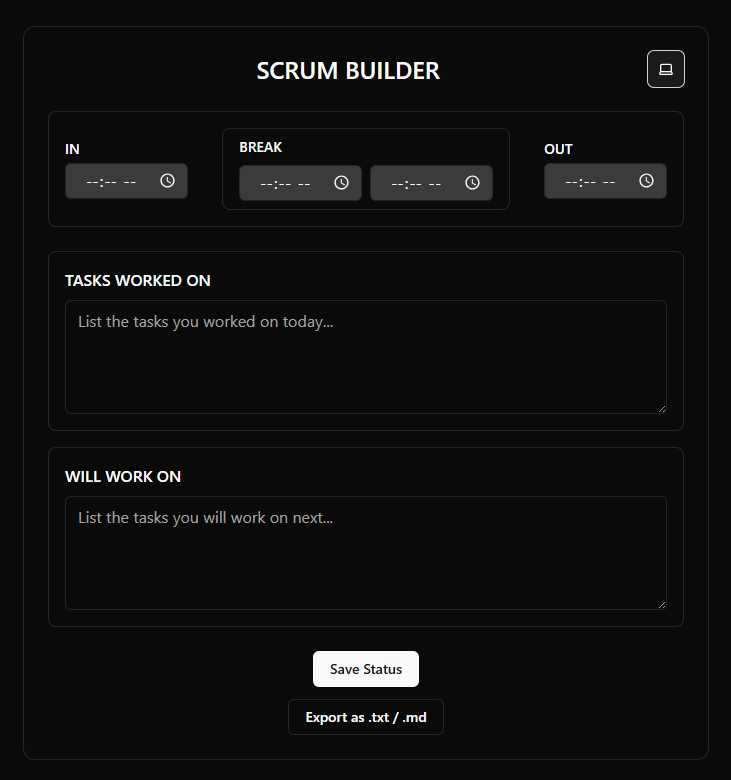

# 📊 Scrum Report Builder

<p align="center">
  
  
  
  
</p>

An elegant and lightweight desktop app designed to help you quickly log daily work summaries, automatically calculate work hours, and export clean reports for archival or sharing. No internet required, no third-party services, just fast, local reporting.

<br>

<p align="center">
  <em>(Strongly recommended: Add a screenshot or GIF of your app here!)</em>
  <br>
  
</p>

---

## ✨ Key Features

*   **Effortless Time Logging:** Quickly input your start, end, and break times.
*   **Automated Work Hour Calculation:** The app automatically calculates your total effective work hours, minus your break.
*   **Structured Summaries:** Dedicated text areas for "Tasks Worked On" and "Tasks to Be Worked On."
*   **One-Click Export:** Instantly generate and save your report as both `.txt` and `.md` files in your Documents folder.
*   **Theme Support:** Toggle between Light, Dark, and System default themes for your comfort.
*   **Fully Local & Private:** Your data never leaves your machine. The app works completely offline.
*   **Resizable UI:** The interface smoothly adapts to any window size.

---

## 💻 Tech Stack

| Component | Technology | Purpose |
| :--- | :--- | :--- |
| **Framework** | Electron | Creates the cross-platform desktop application. |
| **UI Library** | React (Vite) | Powers the dynamic and interactive user interface. |
| **Styling** | Tailwind CSS | Provides a fast and clean utility-first styling system. |
| **Components** | shadcn/ui | A set of beautiful, accessible, and customizable UI components. |
| **Backend Logic** | Node.js | Handles file system operations (creating and saving reports). |
| **Bridge** | Electron IPC | Securely communicates between the UI and the backend file system. |

---

## 🚀 Getting Started

Follow these instructions to get a local copy up and running for development.

### Prerequisites

*   **Node.js** (v18 or later recommended)
*   **npm** or **yarn**

### Installation & Setup

1.  **Clone the repository:**
    ```sh
    git clone https://github.com/aadilahammad86/Scrum_Report_Builder.git
    ```

2.  **Navigate to the project directory:**
    ```sh
    cd Scrum_Report_Builder
    ```

3.  **Install dependencies:**
    ```sh
    npm install
    ```

---

## 🛠️ Development

To run the app in development mode with live-reloading:

```sh
npm run dev
```

This will start the Vite development server and launch the Electron application. Any changes you make to the React code in the `/src` directory will be reflected instantly.

---

## 📦 Building for Production

To build the application and create a distributable installer (`.exe` for Windows):

```sh
npm run dist
```

The final installer will be located in the `release-builds` directory.

---

## 📂 Project Structure

The project is organized with a clear separation between the Electron main process and the React renderer process.

```
Scrum_Report_Builder/
│
├── main.cjs              # Electron main process (handles window creation & file saving)
├── preload.js            # Secure bridge for IPC communication
├── package.json          # Project scripts and dependencies
├── vite.config.js        # Vite build configuration
│
├── /dist/                # Production build output from Vite
│   └── index.html
│
├── /src/                 # React source code
│   ├── App.jsx           # Main React component and UI logic
│   └── main.jsx          # React entry point
│
└── Documents/WorkLogs/   # Auto-created directory for exported reports
    └── ...
```

---

## 🗺️ Roadmap

We have a number of features planned for future releases:

-   [ ] ⏱️ Live calculation and display of total work hours on the UI.
-   [ ] 🧾 A "Weekly Summary" mode to combine multiple daily logs.
-   [ ] ☁️ Optional export to cloud services like Google Drive or OneDrive.
-   [ ] 📆 A date selector for creating or viewing backdated entries.
-   [ ] 📊 A dashboard with charts for a visual productivity overview.

---

## 🤝 Contributing

Contributions are what make the open-source community such an amazing place to learn, inspire, and create. Any contributions you make are **greatly appreciated**.

1.  Fork the Project
2.  Create your Feature Branch (`git checkout -b feature/AmazingFeature`)
3.  Commit your Changes (`git commit -m 'Add some AmazingFeature'`)
4.  Push to the Branch (`git push origin feature/AmazingFeature`)
5.  Open a Pull Request

---

## 📄 License

Distributed under the MIT License. See `LICENSE` for more information.
